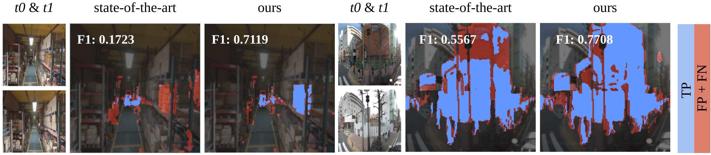
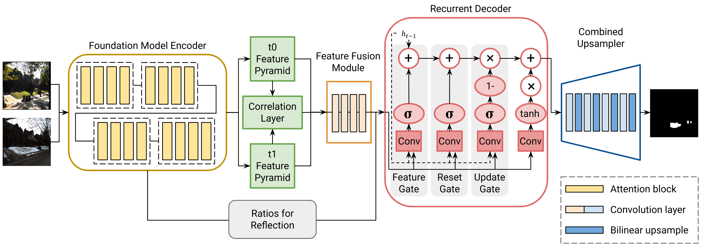

# TERDNet

Transformer Encoder–Recurrent Decoder Network for Scene Change Detection
ICRA 2026 Official Implementation

[](https://github.com/AutoCompSysLab/TERDNet)
[](https://github.com/AutoCompSysLab/TERDNet)


## Overview

This repository provides the official implementation of **TERDNet**, proposed in:

> TERDNet: Transformer Encoder–Recurrent Decoder Network for Scene Change Detection
> ICRA 2026

<p align="center">
  
</p>

TERDNet consists of:

* Transformer-based encoder
* Correlation-aware feature fusion module
* 3-gate GRU recurrent decoder
* Progressive upsampling module


## Architecture

<p align="center">
  
</p>


## Datasets

We follow the official splits of the following Scene Change Detection benchmarks:

- **VL-CMU-CD**  
  http://vl-cmu-cd.cs.cmu.edu/

- **TSUNAMI**  
  https://github.com/SakuradaK/ChangeDetectionDataset

- **PSCD**  
  https://github.com/KeiSakurada/PSCD

- **ChangeSim**  
  https://github.com/AI-ChangeSim/ChangeSim

## Pretrained Models

This implementation supports pretrained transformer backbones.

* Segment Anything Model (SAM)
  [https://github.com/facebookresearch/segment-anything](https://github.com/facebookresearch/segment-anything)

## Training

Example training command:

```bash
python -u src/train.py \
    --train-dataset VL_CMU_CD \
    --test-dataset VL_CMU_CD \
    --data-cv 0 \
    --input-size 1024 \
    --model vit_b_terdnet \
    --fusion-type ours \
    --pyramid-levels 4 \
    --decoder-iters 3 \
    --warmup \
    --loss-weight
```


## Acknowledgement

This implementation is built upon:

* C-3PO
  [https://github.com/wgcban/C-3PO](https://github.com/wgcban/C-3PO)

* Segment Anything Model (SAM)
  [https://github.com/facebookresearch/segment-anything](https://github.com/facebookresearch/segment-anything)

We thank the authors for releasing their code and pretrained models.

## Citation
```bash
@InProceedings{Yoon_2026_ICRA,
    author    = {Yoon, Jiae and Kim, Ue-Hwan},
    title     = {TERDNet: Transformer Encoder-Recurrent Decoder Network for Scene Change Detection},
    booktitle = {IEEE International Conference on Robotics and Automation (ICRA)},
    month     = {June},
    year      = {2026},
}
```
